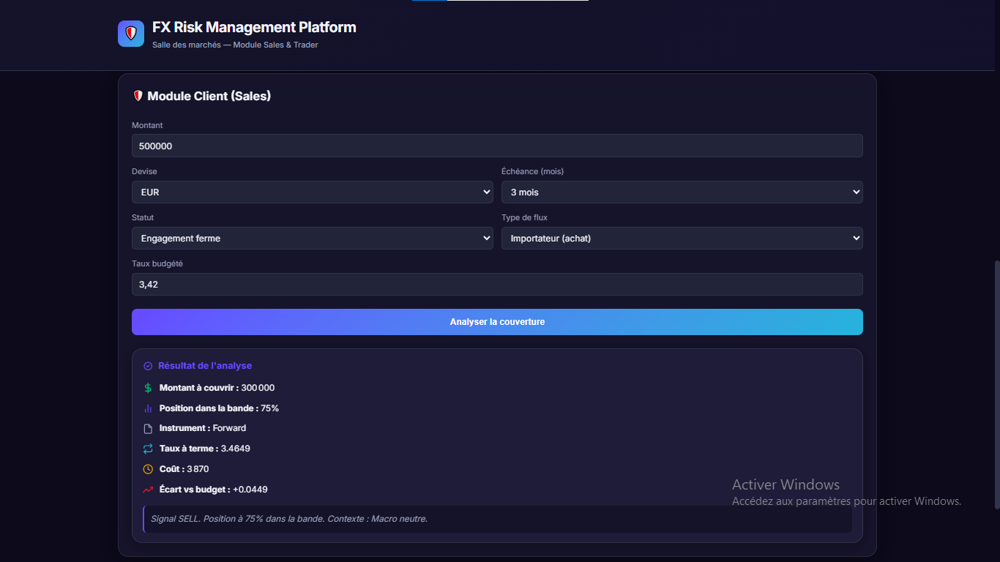
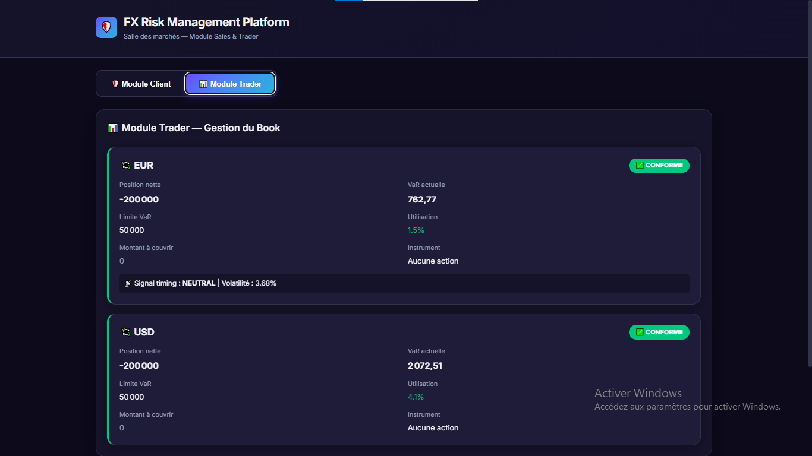
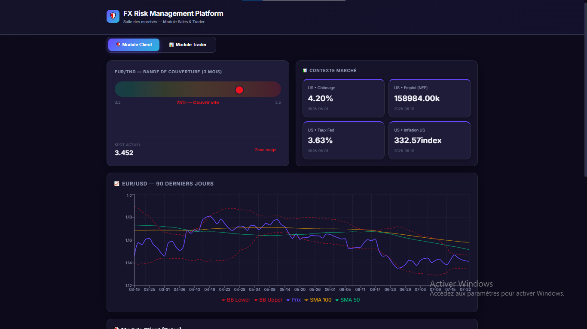

# FX Risk Management Platform

A dual-module platform simulating how a bank trading room manages FX risk, combining technical, fundamental, and sentiment analysis to support hedging decisions for corporate clients and internal book management.

Built during my sales forex internship at BH Bank to connect academic finance theory with real trading room decision-making.

🔗 **Live demo:** https://fx-risk-platform-eight.vercel.app/
📊 **Backend API:** https://fx-risk-api.onrender.com/docs

## Overview

The platform has two modules:

### 🛡️ Client Module (Sales)
Helps sales/relationship managers advise corporate clients on FX exposure:
- Coverage band positioning (spot vs. budgeted rate)
- Hedging instrument recommendation
- Cost simulation and gap vs. budget rate

### 📊 Trader Module (Book Management)
Aggregates and monitors the trading desk's FX book:
- Net position per currency pair
- Parametric VaR vs. risk limits
- Exposure alerts when limits are approached or breached

## How signals are built

Each currency pair gets a combined score from three pillars:

| Layer | What it covers |
|---|---|
| **Technical** | SMA (50/100/200), RSI, Bollinger Bands, ATR |
| **Fundamental** | Fed rate, CPI, unemployment (EUR/USD) · EUR/TND & USD/TND fixings (BCT) |
| **Sentiment** | Keyword-based scoring of central bank communication (hawkish/dovish) |

## Tech stack

**Backend:** Python, FastAPI, SQLAlchemy, SQLite
**Frontend:** React 19, TypeScript, Vite, Recharts
**Data sources:** Frankfurter API, FRED, ECB SDW, CFTC Socrata, BCT (Banque Centrale de Tunisie)
**Deployment:** Vercel (frontend) · Render (backend)

## Running locally

**Backend**
```bash
cd backend
python -m venv .venv
.venv\Scripts\activate      # Windows
pip install -r requirements.txt
uvicorn app.main:app --reload --port 8000
```

**Frontend**
```bash
cd frontend
npm install
npm run dev
```

## Screenshots





## Project context

This is a portfolio project built to strengthen my profile for a career in FX sales and trading, combining hands-on exposure from my BH Bank internship with self-directed learning in market structure, risk management, and quantitative finance.

## Author

**Jawher Ayari** — Finance graduate, IHEC Carthage
[LinkedIn](https://www.linkedin.com/in/jawher-ayari)
